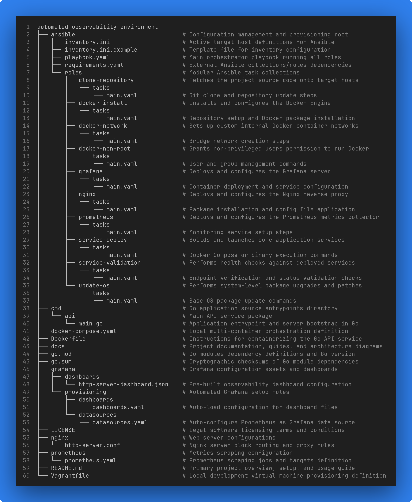
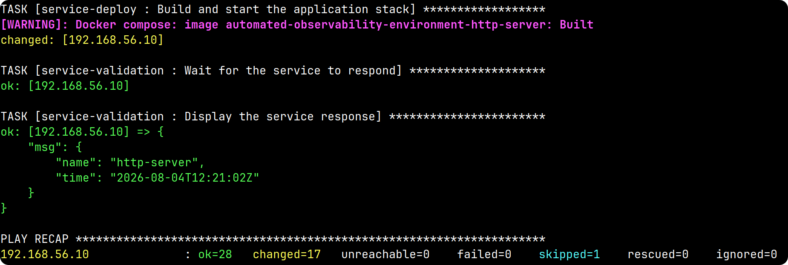
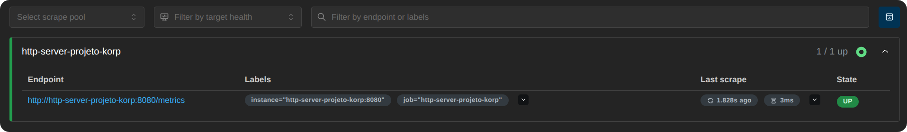
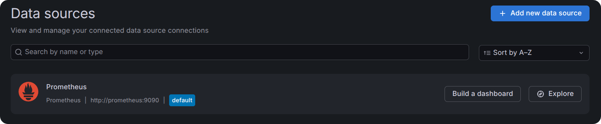
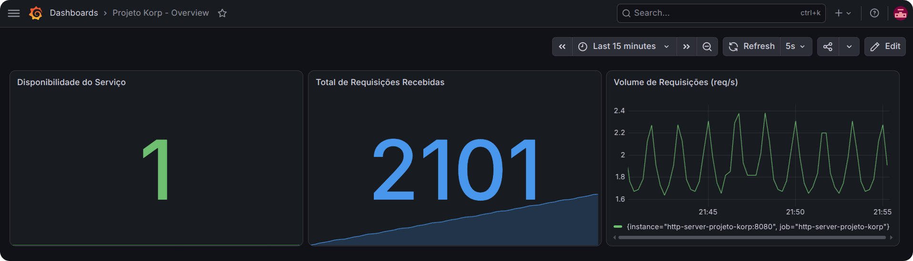
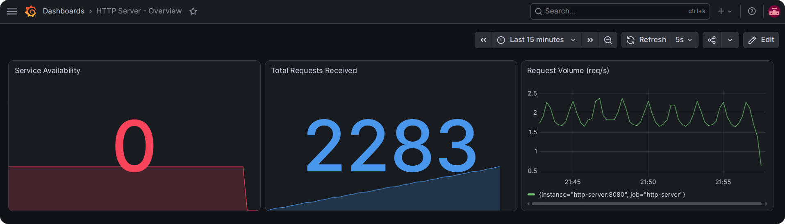

# **Automated Observability Environment**

<p align="justify">
   
   
   
   
   
   
   
   
   
</p>

A containerized HTTP service built in **Go** with **Gin**, fully provisioned and automated with **Ansible** on a **Vagrant**-managed virtual machine. The service's behavior is monitored in real time with a complete observability stack using **Prometheus** and **Grafana**.

## Table of Contents

- [Overview](#overview)
- [Architecture](#architecture)
- [Containers and Docker Compose](#containers-and-docker-compose)
- [Tech Stack](#tech-stack)
- [Project Structure](#project-structure)
- [Getting Started](#getting-started)
- [Usage Example](#usage-example)
- [Observability Stack](#observability-stack)
- [Infrastructure Provisioning with Vagrant and Ansible](#infrastructure-provisioning-with-vagrant-and-ansible)
- [Proof of Execution](#proof-of-execution)
- [Architectural Decisions](#architectural-decisions)

<a id="overview"></a>
## 📖 Overview

This project is a small HTTP service, `http-server`, that exposes a single endpoint returning its name and the current UTC time. While the service itself is intentionally simple, the project's real focus is the infrastructure and automation around it: a reverse proxy, a full observability stack, and an entirely automated provisioning pipeline that takes a basic Linux VM and turns it into a fully running environment with a single **Ansible** command.

This project emphasizes clear architectural decisions, reproducibility, and infrastructure best practices, treating a deliberately small application as a vehicle for exploring container networking, observability, and configuration management in depth.

<a id="architecture"></a>
## 🏗️ Architecture

The way requests move through the system is straightforward:

1. A client sends an HTTP request to port `80`, the only port exposed to the host.
2. **Nginx** receives it and reverse-proxies it internally to the Go application on port `8080`.
3. The Go application processes the request and returns the response through Nginx, back to the client.
4. Independently, **Prometheus** scrapes the application's `/metrics` endpoint directly over the internal Docker network, on port `8080`, bypassing Nginx entirely.
5. **Grafana** queries Prometheus and renders the collected metrics on the provisioned dashboard.

All four containers, `http-server`, `nginx`, `prometheus`, and `grafana`, run on a shared Docker bridge network (`observability-network`), created by Ansible before any container starts. The application container is the only one that does not expose any port to the host; it is reachable exclusively from within that network.

<a id="containers-and-docker-compose"></a>
## 🐳 Containers and Docker Compose

Four containers, all connected to the same externally-managed bridge network:

| Container | Exposed to host? | Purpose |
|---|---|---|
| `http-server` | No | The **Go** application |
| `nginx` | Yes (`80:80`) | Reverse proxy, the only public entry point |
| `prometheus` | Yes (`9090:9090`) | Metrics collection and querying |
| `grafana` | Yes (`3000:3000`) | Metrics visualization |

<a id="tech-stack"></a>
## 🧰 Tech Stack

| Layer | Technology |
|---|---|
| Application | **Go** 1.26, [**Gin**](https://github.com/gin-gonic/gin) |
| Containerization | **Docker**, **Docker Compose** |
| Reverse proxy | **Nginx** |
| Metrics | **Prometheus** (`client_golang`) |
| Visualization | **Grafana** |
| Infrastructure provisioning | **Vagrant**, **VirtualBox** |
| Configuration management | **Ansible** |
| Operating System | **Ubuntu** 22.04 LTS (Jammy) |

> [!IMPORTANT]
> **Ubuntu** was chosen as the operating system for the virtual machine purely for convenience during development and testing.
>
> Feel free to use a different Linux distribution if you prefer. Just keep in mind that if you choose a distribution that is not Debian-based or does not use the **APT** package manager, you will need to adapt the **Ansible** playbooks. They currently rely on modules and tasks designed for **APT**-based environments, so they will not work correctly on distributions that use other package managers (such as `dnf`, `pacman`, etc.) without the necessary adjustments.

<a id="project-structure"></a>
## 🗂️ Project Structure



<a id="getting-started"></a>
## 🚀 Getting Started

This repository does not cover the installation process for the host tools used in the project, such as **Vagrant**, **VirtualBox**, and **Ansible**. **Go**, **Docker**, and **Docker Compose** are not required on your host machine either, they are installed automatically inside the virtual machine by the **Ansible** playbook.

The installation process for the host tools can vary significantly depending on your operating system, Linux distribution, package manager, and even the installation method you choose. For this reason, the recommended approach is always to follow the official documentation for each technology, using the instructions specific to your environment.

Once **Vagrant**, **VirtualBox**, and **Ansible** are installed and confirmed to be working correctly, you'll be ready to run this project.

### 🔧 Prerequisites

- [**Vagrant**](https://www.vagrantup.com/)
- [**VirtualBox**](https://www.virtualbox.org/)
- [**Ansible**](https://docs.ansible.com/) (on the control machine, not the VM)

### 📥 1. Clone this repository

```bash
git clone https://github.com/thomaspalma1/automated-observability-environment.git
cd automated-observability-environment
```

### 💻 2. Bring up the virtual machine

```bash
vagrant up
```

This creates an **Ubuntu** 22.04 VM with a fixed private network IP (`192.168.56.10`). No software provisioning happens at this stage, since **Vagrant** is only responsible for creating the machine itself.

> [!NOTE]
> This private IP address was chosen solely for convenience during the project's development.
>
> If you want to change it, feel free to use another address within your private network, as long as you update it in every location where it's referenced:
>
> - `Vagrantfile`, where the virtual machine's IP address is defined.
> - `ansible/inventory.ini`, inside the `observability_environment` group, where the managed machine's address is configured.
>
> Make sure both files use the same address to avoid communication issues between **Vagrant** and **Ansible**.

### 📋 3. Prepare the Ansible inventory

```bash
cp ansible/inventory.ini.example ansible/inventory.ini
```

### 📦 4. Install required Ansible collections

Inside the `ansible` directory, run:

```bash
ansible-galaxy collection install -r requirements.yaml
```

### 🔨 5. Provision the entire environment

Still inside the same directory, run:

```bash
ansible-playbook -i inventory.ini playbook.yaml
```

This single command installs **Docker**, configures a non-root user, creates the **Docker** network, clones this repository into the VM, configures **Nginx**, **Prometheus**, and **Grafana**, builds the application image, brings up the full stack, and finally validates the service with an HTTP request, printing the response directly to your console.

<a id="usage-example"></a>
## 🧪 Usage Example

Once provisioning completes, the service is reachable through the **Nginx** reverse proxy:

```bash
curl http://192.168.56.10/status
```

```json
{
  "name": "http-server",
  "time": "2026-08-02T00:00:18Z"
}
```

Direct access to the application container is intentionally blocked. The service never exposes port `8080` to the host:

```bash
curl http://192.168.56.10:8080/status
# curl: (7) Failed to connect to 192.168.56.10 port 8080: Connection refused
```

### 📶 Generating traffic for demonstration purposes

To see the **Grafana** dashboard react to live traffic, particularly the request volume panel, the following script fires a variable number of requests per second against the service, cycling through a fixed sequence of rates, peaking at 10 concurrent requests per burst:

```bash
# Defines the request load pattern.
# Each range represents a gradual increase or decrease in the number of
# requests sent, creating a wave-like traffic pattern over time.

load_pattern=({1..10} {9..3} {4..10} {9..1})

while true; do
  for request_count in "${load_pattern[@]}"; do
    echo "RPS: $request_count"

    for ((request = 0; request < request_count; request++)); do
      curl -s http://192.168.56.10/status &
    done

    wait
    sleep 3
  done
done
```

Stop it at any time with `Ctrl+C`.

<a id="observability-stack"></a>
## 📡 Observability Stack

| Tool | Role |
|---|---|
| **Prometheus** | Scrapes and stores metrics exposed by the Go service |
| **Grafana** | Visualizes metrics through an auto-provisioned dashboard |

Access, once the environment is up:

| Interface | URL |
|---|---|
| **Prometheus** UI | http://192.168.56.10:9090 |
| **Prometheus** Targets page | http://192.168.56.10:9090/targets |
| **Prometheus** Graph/query page | http://192.168.56.10:9090/graph |
| **Grafana** UI | http://192.168.56.10:3000 (`admin` / `admin`) |
| **Grafana** dashboard, direct link | http://192.168.56.10:3000/d/status-overview |

> [!NOTE]
> The default `admin` / `admin` credentials are only appropriate for this local development environment. In a production setting, credentials like these should never be committed to a repository, they should be managed through environment variables, a secrets manager, or an equivalent solution.

### 📐 Prometheus

Two metrics are collected from the service:

- `up`, Prometheus's native metric for every scrape target: `1` when the last scrape succeeded, `0` otherwise. This reflects **liveness** (is the process reachable) rather than **readiness** (is the process functioning correctly). Since this service has no external dependencies, such as a database or a downstream API, there is currently no scenario where the process would be running but functionally broken, so the two concepts collapse into the same signal here. A service with such dependencies would benefit from a dedicated `/health` endpoint performing deeper checks, distinguishing "the process is up" from "the process is actually able to do its job."
- `http_requests_total`, a custom counter incremented on every call to `/status`, exposed in Prometheus exposition format via `client_golang`.

To validate the metrics directly in the Prometheus UI (`/graph`):

| Query | What it shows |
|---|---|
| `up{job="http-server"}` | Service availability: `1` if up, `0` if down |
| `http_requests_total` | Total requests received since the process started |
| `rate(http_requests_total[1m])` | Requests per second, averaged over the last minute |

### 📺 Grafana

The **Grafana** dashboard, `HTTP Server - Overview` (uid `http-server-overview`), is auto-provisioned on startup via the files in `grafana/provisioning/`, along with a **Prometheus** data source pointing at `http://prometheus:9090`. No manual setup is required to see it.

It has three panels: *Service Availability* (stat panel), *Total Requests Received* (stat panel), and *Request Volume* (time series using `rate(http_requests_total[1m])`).

To find it manually: log in, open **Dashboards** in the left sidebar, and select `HTTP Server - Overview` (it lives in the default folder).

<a id="infrastructure-provisioning-with-vagrant-and-ansible"></a>
## ⚙️ Infrastructure Provisioning with Vagrant and Ansible

- **Vagrant** is scoped narrowly: it only creates the VM (box, hostname, network, resources). It performs no software provisioning, since that responsibility belongs entirely to **Ansible**, avoiding duplicated responsibility between the two tools.
- **Ansible** handles everything inside the guest OS, organized into single-responsibility roles:

| Role | Responsibility |
|---|---|
| `update-os` | Updates the apt cache and upgrades packages |
| `docker-install` | Installs **Docker** following the official documentation for **Ubuntu** |
| `docker-non-root` | Adds the deployment user to the `docker` group |
| `docker-network` | Creates the `observability-network` bridge network |
| `clone-repository` | Clones this repository into the VM |
| `nginx` | Deploys the reverse proxy configuration |
| `prometheus` | Deploys the scrape configuration |
| `grafana` | Deploys datasource and dashboard provisioning files |
| `service-deploy` | Builds the application image and brings up the full stack |
| `service-validation` | Validates the service via HTTP and prints the response to the console |

<a id="proof-of-execution"></a>
## ✅ Proof of Execution

The following captures follow the natural order of validation. The environment is provisioned, the service responds, **Prometheus** confirms it is collecting metrics, and **Grafana** confirms it is visualizing them.

### 🖥️ 1. Ansible playbook run, ending with the smoke test response

Shows the final task of the playbook printing the service's JSON response directly to the console.



### 🎯 2. Prometheus, Targets page

Confirms the scrape configuration is active and the service is being monitored continuously, not just queried once manually.



### 🔌 3. Grafana, Data Sources page

Confirms the **Prometheus** data source was connected automatically through provisioning files, not configured manually through the UI.



### 🖼️ 4. Grafana Dashboard

The end result of the monitoring setup: all metrics visualized side by side.



### 🔴 5. Grafana Dashboard, service unavailable

A simulated failure, showing how the availability panel reacts when the service stops responding, making the outage immediately visible.



<a id="architectural-decisions"></a>
## 🧭 Architectural Decisions

A few decisions were made where more than one approach would have worked, or where a more conventional option was intentionally traded for one that better fit this project's scope. Each is documented here with its rationale.

### 🌐 Network ownership

Declaring the network inside `docker-compose.yaml` would work, but it introduces a real operational risk: running `docker compose down` would remove a network that could, in a broader setup, be shared by other services. Creating it explicitly via **Ansible** (`community.docker.docker_network`) and referencing it as `external: true` in **Compose** keeps its lifecycle independent from the application stack, which is a common pattern in real infrastructure.

### 🔍 Prometheus scrape path

The `/metrics` endpoint is meant for machine-to-machine consumption, not for external or human access. Routing it through **Nginx** would add a layer with no functional benefit, since **Nginx** currently has no route configured for it. **Prometheus** reaches the service directly over the internal **Docker** network, which does not conflict with keeping the application container fully isolated from the host, since that isolation only restricts host-level access, not access from other containers on the same network.

### 🚢 Code delivery strategy

Rather than copying files from the control machine into the VM, the `clone-repository` role clones the project's public GitHub repository directly. This mirrors a more realistic deployment flow and guarantees the provisioned environment always reflects exactly what is published in the repository, eliminating any risk of divergence from local, uncommitted changes.

In a real production environment, a **CI/CD** pipeline would build and version a **Docker** image, pushing it to a registry (**Nexus**, **Cloudsmith**, **AWS CodeArtifact**, etc.), so deployment would consume a pre-built image rather than building on the target host. Given this project's scope, the GitHub repository itself is treated as the source of truth, so the image is built during provisioning instead.

### 📁 Configuration file locations

Following the Linux Filesystem Hierarchy Standard, the cloned repository (source code) lives under `/opt/automated-observability-environment`, while the configuration files actually consumed by each container are copied to `/etc/automated-observability-environment/<service>` by dedicated **Ansible** roles. This keeps the git checkout and the deployed configuration as two clearly separated concerns, even though both ultimately originate from the same single source of truth: the repository.

### 🔄 Consistency across configuration roles

**Grafana** supports provisioning its dashboard and data source manually through the UI. **Nginx** and **Prometheus**, however, have no equivalent manual path, their configuration always lives in a file, regardless of how it gets there. To keep the automation consistent and avoid two different delivery strategies for conceptually similar configuration files, all three services, **Nginx**, **Prometheus**, and **Grafana**, are configured through dedicated, single-responsibility **Ansible** roles.

### 🔐 Non-root Docker access

This is not strictly required for the **Ansible**-driven provisioning to work, since all **Ansible** tasks already run with elevated privileges via `become: true`. However, it follows **Docker**'s official post-installation recommendation and makes manual inspection of the environment (`vagrant ssh` followed by `docker ps`, without `sudo`) considerably more convenient.

## 🧠 Closing Note

<p align="center">
  
</p>